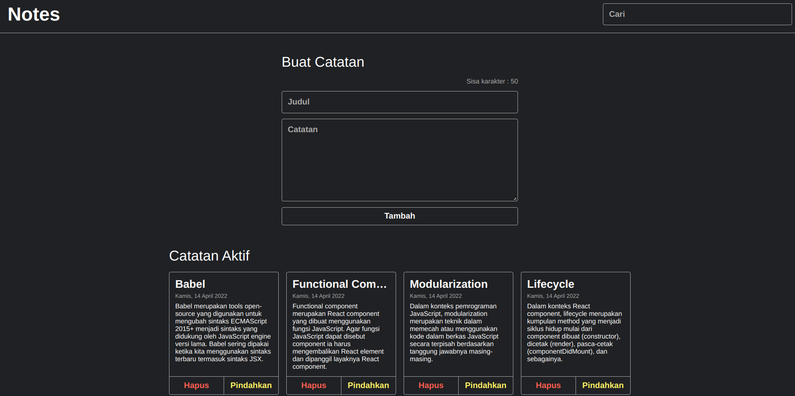

# Personal Notes
> Notes website built using React by implementing state and component.
> Live demo [_here_](https://personaldailynotes.netlify.app/).

## Table of Contents
* [General Info](#general-information)
* [Technologies Used](#technologies-used)
* [Features](#features)
* [Screenshots](#screenshots)
* [Setup](#setup)
* [Project Status](#project-status)
* [Room for Improvement](#room-for-improvement)
* [Acknowledgements](#acknowledgements)
* [Contact](#contact)

## General Information
- Manage daily activities.
- This website is used to record any notes that can help us remember simple things.

## Technologies Used
- NodeJS - version 16.17.0
- React - version 18.2.0

## Features
- :heavy_plus_sign: Add notes by filling in the **title** and **content**.
- :no_entry: Delete notes in **active** and **archive** sections.
- :bookmark_tabs: Display a **list** of active notes.
- :warning: Limit the number of characters and display the remaining characters in the **title**.
- :books: Move notes to **archive** section.
- :mag_right: Search notes by **title**.

## Screenshots


## Setup
To run this project, install it locally using npm:

```
$ cd ../personal-notes
$ npm install
$ npm start
```
## Project Status
Project is: _in progress._ <!-- / _complete_ / _no longer being worked on_. reason ? -->

## Room for Improvement

Room for improvement:
- Add some functions for better experience.
- Beautify the appearance of the website with css.

To do:
- Save data records to database.
- Edit notes.

## Acknowledgements
- This project was based on [this course](https://www.dicoding.com/)
- Many thanks to **Dicoding Indonesia**

## Contact
Created by [@Zulhaditya](https://itsmyportofolio.netlify.app/) - feel free to contact me!
